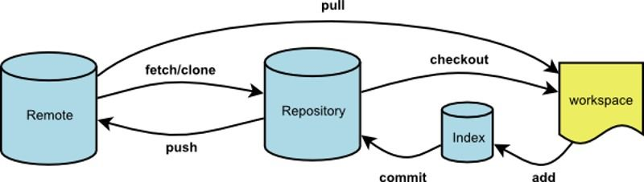
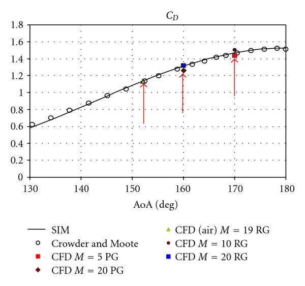

.. |br| raw:: html

      

Packing List
============

   |c_right_ico1|\ |c_right_ico2|\ |c_right_ico3|

   |c_right_ico4|\ |c_right_ico5|\ |c_right_ico6|

.. note::
     Some attention content

.. hint::
     Some attention content

.. tip::
     Some attention content

.. attention::
     Some attention content

.. important::
     Some attention content

.. caution::
     Some attention content

.. warning::
     Some attention content

.. error::
     Some attention content

.. danger::
     Some attention content

.. code-block:: none

    for(int j=0; j<size; j++)
    {
        if(arr[j]!=-1)
        {
            printf("The result is :%d",j);
            break;
        }
    }

.. code-block:: c

    for(int j=0; j<size; j++)
    {
        if(arr[j]!=-1)
        {
            printf("The result is :%d",j);
            break;
        }
    }

.. code-block:: python

    import calendar
    year = int(input("Input Year:"))
    check_year=calendar.isleap(year)
    if check_year == True:
        print ("leap year")
    else:
        print ("comm year")

.. code-block:: html

    <!DOCTYPE HTML>
    <!DOCTYPE html>
    <html xmlns="http://www.w3.org/1999/xhtml">
    <head>
      <title></title>
    </head>
    <body>
      
A picture: 

      
A motion picture: 

    </body>
    </html>

Introduction
============

   LoRaWan Gateway’s interfaces and connectors are illustrated below: 中文

   .. image:: pics/media/rocket.jpg
   

   **Ports and Connectors**

1. Antenna Port (2.4G Wi-Fi)

2. Ethernet Port (Support PoE)

3. Console Port

4. Nano SIM Socket

5. TF Card Socket

6. Ground Pad

7. Ground Pad

8. Antenna Port (GPS)

9. Antenna Port (Lora)

..

   **LED**

A. Power

B. Ethernet

C. LoRa1

D. NB-IoT Active

E. LoRa2 or NB-IoT Status

F. WLAN

Installation
============

   LoRaWan Gateway can be installed in two ways:

-  Pole Mounting

-  Wall Mounting

Pole Mounting
-------------

   **Step 1**: Fix the mount kit on the bottom of the device with four M5*8 screws as shown below:

   |v2-90e14b750d27677866b4e34e4f52fd4a_1440w|

   **Step 2**: Slide the Steel band clamps through the rectangular hole of the mount kit, wrap the band clamps around the pole, lock them and then tighten the clamps using a screwdriver.

Wall Mounting
-------------

   **Step 1**: Use Ø5mm drill head, drill 4 holes on the wall according to the dimension of the following picture and then plug the srew anchors in the wall;

   |857061.fig.0016b|

   **Step 2**: Use the tapping screws, attach the device to the wall.

Warranty Card
=============

   Please fill in (*asterisk must be filled), and safekeep the warranty certificate.

   Please fill in the information of product:

   \*Product Model: \____________________________________________________________\_

   \*Product ID: \_______________________________________________________________\_

   Please fill in the information of customer:

   User’s Name: \______________________________________________________________\_

   Address: \__________________________________________________________________\_

   `Tel: \_______________________\_ <Tel:________________________>`__\ \______________________________________________\_

   E-mail: \___________________________________________________________________\_

   Please fill in the information of distributor:

   \*Distributor: \_______________________________________________________________\_

   \*Tel: \_____________________________________________________________________\_

   \* Date of Purchase: \__________________________________________________________\_

**
**

**Revision History**

======== =============== ==========
Revision Description     Date
1.00     Initial version 2018-07-29
======== =============== ==========

.. |c_right_ico2| image:: pics/media/image5.png
   :width: 1.14583in
   :height: 1.14583in

